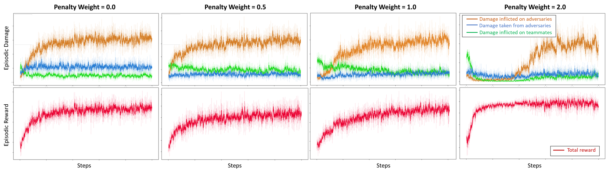
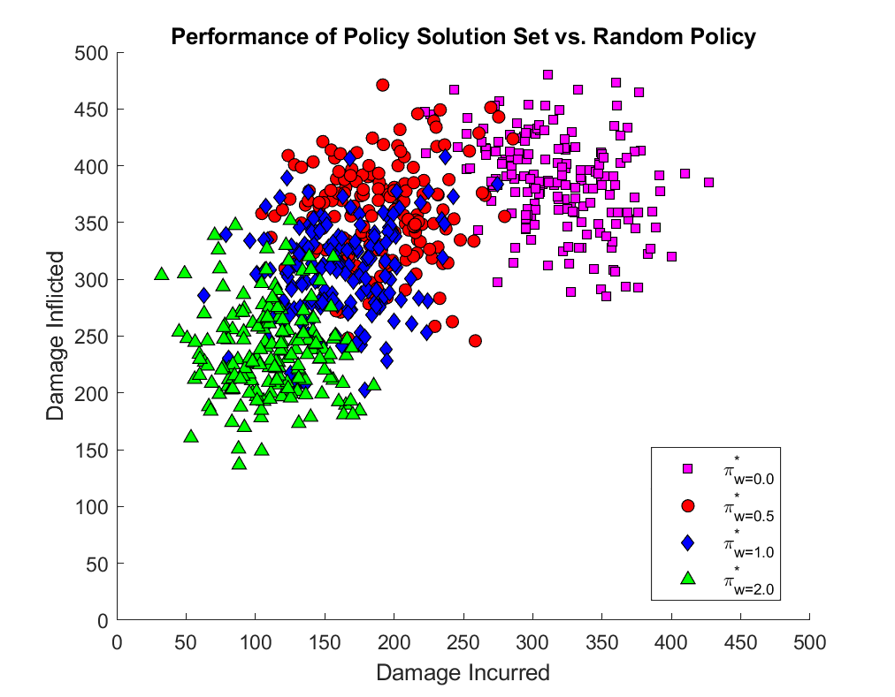

Our work is based on the AI Safety Tanksworld environment [1] which simulates a team-based battle among tanks which requires cooperation and competition among different agents. The environment serves as a test-bed for multi-agent reinforcement learning research, especially in the safety domain. One essential component of the environment is performance and safety trade-offs between competing objectives which we address in this paper with a formal baseline.

In AI Safety Tanksworld, agents have two main objectives which are inflicting damage on the opposing team and avoiding damage among allies. These two objectives compete with each other and satisfying them at the same time requires a complex strategy. In this sense, our baseline supports the research in risk-sensitive and multi-objective reinforcement learning in an environment which is more complex than other safety testbeds.

# Experimental Setup
For our baseline, we use centralized training - decentralized execution framework. That means five agents share a common 
policy but they draw their actions independent of each other. 
Based on the results in [2], we use state-of-the-art Proximal Policy Optimization (PPO) algorithm [3] and we find it to 
be effective in this benchmark as well as other multi-agent settings.

# Hyperparameters
We search through various hyperparameters to generate the Pareto frontier for the Tanksworld environment. In particular 
we consider two categories of training parameters:

- Reward parameters
    - Damage taken weight: [0.0, 0.5, 1.0, 2.0]
- Learning parameters
    - Actor learning rate: [1e-3, 3e-4, 5e-5]
    - Critic learning rate: [1e-3, 5e-4, 1e-4]
    - Batch size: [32, 64, 128]

Reward parameters reflect system design goals to some degree. They impact the nature of the interaction between the agents 
and the environment and hence affect the nature of the learning problem (e.g., higher penalties generally result in more 
cautious behaviours). In general, as we vary the reward parameters, we expect to see agent performance that represents 
different tradeoffs between the accrual of positive and negative rewards.

On the other hand, the selection of learning parameters presents a natural tradeoff given the multi-objective nature of 
the problem. For example, larger batch sizes may be necessary to mitigate reward sparsity but increase the likelihood of 
aggregating positive and negative contributions within a single gradient calculation (in particular, given the high value 
selected for the discount factor).

We fix the rest of the hyperparameters with the following values based on [3]:

- Number of epochs : 4
- Discount factor : 0.99
- GAE coefficient : 0.95
- Clip ratio : 0.2
- KL divergence target : 0.015
- Initial value of standard deviation : 0.6

# Rewards and Penalties
Since the problem consists of multiple objectives, there are several rewards and penalties to optimize. In this paper, 
we assume red team is the one which learns a policy, and blue team randomly draws actions from a uniform distribution. 
Our aim is to optimize the objectives on behalf of the red team.

The TanksWorld environment generates reward feedback for each agent at each timestep consisting of several terms. 
The full set of reward signals is described in more detail here [1]. For the purpose of these experiments, we utilize a 
subset of the available signals to define the following key performance parameters for the multi-agent team:

- Total damage inflicted on the adversary team during an episode
- Total damage incurred by the ally team during an episode

Each episode produces a multivariate performance outcome (inflicted damage and incurred damage). Since each tank starts 
an episode with 100 health points, episodic damage outcomes for the 5-tank teams, damages will lie on the range [0,500].
For scalarizing the reward in training time, we need to use a linear combination of two damage terms with a coefficient 
for the incurred damage.

# Results
## Training Curves
The following are the examples of training curves. The first row shows individual damage components (red-to-blue, 
blue-to-red, red-to-red), while the second row shows the scalarized reward.

[Representative learning curves from training runs illustrating the effect on different parameterizations of a 
linear utility function (linear combination of different reward terms) on learned behaviors.]

## Evaluation
We evaluate a trained policy on multiple environments each of which is initialized with a different random seed. 
The random seed determines the initial position of the tanks (for both allies and enemies) and also the randomness 
in the behaviour of the enemy team. The following are the current mean evaluation results for the Pareto frontier 
which is represented by 4 different values for the penalty coefficient.

| Penalty Coefficient | Actor LR | Critic LR | Batch Size | Inflicted Damage | Incurred Damage |
|---------------------|----------|-----------|------------|------------------|-----------------|
| 0.0                 | 3e-4     | 1e-3      | 64         | 388.72±37.63     | 334.62±40.16    |
| 0.5                 | 3e-4     | 5e-4      | 64         | 357.06±42.11     | 189.48±40.77    |
| 1.0                 | 3e-4     | 1e-3      | 128        | 305.68±39.76     | 160.18±34.75    |
| 2.0                 | 1e-3     | 1e-3      | 64         | 159.23±62.50     | 104.97±37.56    |

We evaluate the trained models on 30 different randomly initialized environments and compute the average and standard 
deviation of the metrics across 10 games in each environment. In this way we end up having 300 samples for each evaluation 
run. The following plot shows the mean episode returns for the learned policies in the solution set. For each the 4 frontier 
policies, each point on the plot represents the mean full episode return over 10 evaluation runs for 180 different randomly 
generated instances of the environment. The evaluation runs consist of rollouts of the learned policies with the random 
generation of the environment corresponding to random starting positions for the various tanks and a random initialization 
of the adversary policy.

# Implementation Details

We use a four layer CNN for the representation component which is the NatureCNN architecture in [4]. 
It is challenging to optimize representation and control components simultaneously, therefore we train the CNN alongside a 
policy and then freeze it for the rest of the experiments in order to improve speed and simplify the training process. 
Based on our experiments, the representation trained with a blue-to-red damage weight of 0.65 and friendly fire weight of 0, 
with the optimal learning rates and batch sizes used in Pareto frontier, gives the best performance. In addition to that, 
we train the representation across 5 parallel environments by averaging the gradients across them. With this asynchronous 
training we achieve a faster convergence based on the idea in [5].

We train each model with 3 different policy initializations and 2 different environment initializations for each of the 
policy initializations, therefore in total 6 different random seed combinations. Policy initialization consists of initial 
values of the neural network parameters and random seed for drawing actions from the learnt distribution. On the other hand, 
environment initialization consists of the initial positions of the tanks and random behaviour of the enemy.

# References
[1] Corban Rivera, Olivia Lyons, Arielle Summitt, Ayman Fatima, Ji Pak, William Shao, Robert Chalmers, Aryeh
Englander, Edward Staley, I-Jeng Wang, and Ashley Llorens. Tanksworld: A multi-agent environment for ai
safety research, 02 2020.

[2] Chao Yu, Akash Velu, Eugene Vinitsky, Yu Wang, Alexandre M. Bayen, and Yi Wu. The surprising effectiveness
of mappo in cooperative, multi-agent games. _ArXiv_, abs/2103.01955, 2021

[3] Chao Yu, Akash Velu, Eugene Vinitsky, Yu Wang, Alexandre M. Bayen, and Yi Wu. The surprising effectiveness
of mappo in cooperative, multi-agent games. _ArXiv_, abs/2103.01955, 2021

[4] Volodymyr Mnih, Koray Kavukcuoglu, David Silver, Andrei A. Rusu, Joel Veness, Marc G. Bellemare, Alex
Graves, Martin A. Riedmiller, Andreas Fidjeland, Georg Ostrovski, Stig Petersen, Charlie Beattie, Amir Sadik,
Ioannis Antonoglou, Helen King, Dharshan Kumaran, Daan Wierstra, Shane Legg, and Demis Hassabis. Human-
level control through deep reinforcement learning. Nature, 518:529–533, 2015

[5] Volodymyr Mnih, Adrià Puigdomènech Badia, Mehdi Mirza, Alex Graves, Timothy P. Lillicrap, Tim Harley,
David Silver, and Koray Kavukcuoglu. Asynchronous methods for deep reinforcement learning. In ICML, 2016
